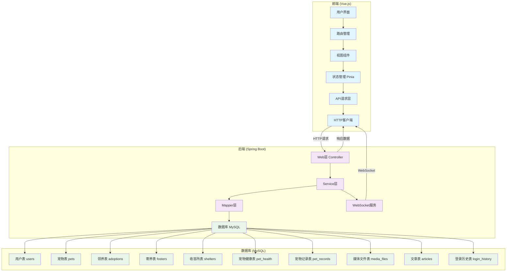
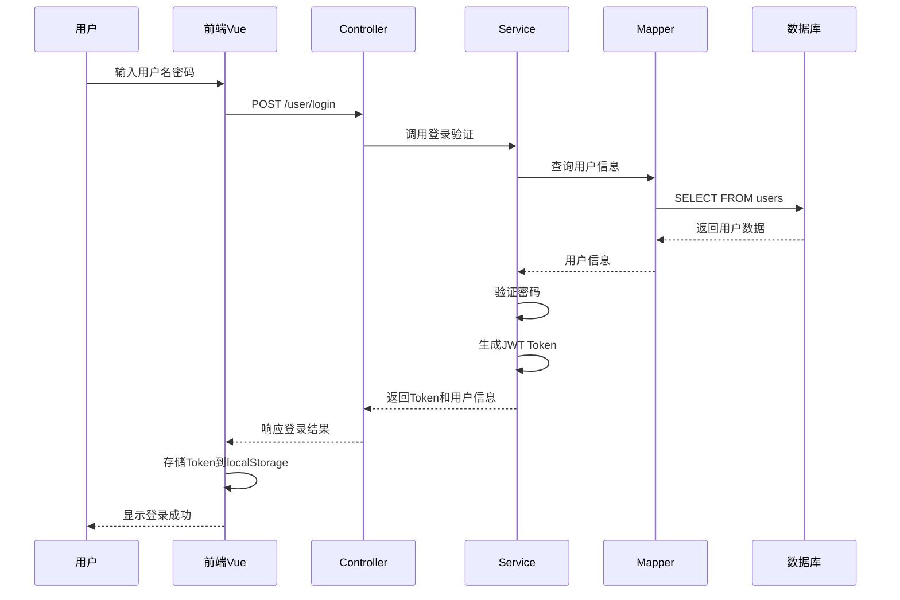
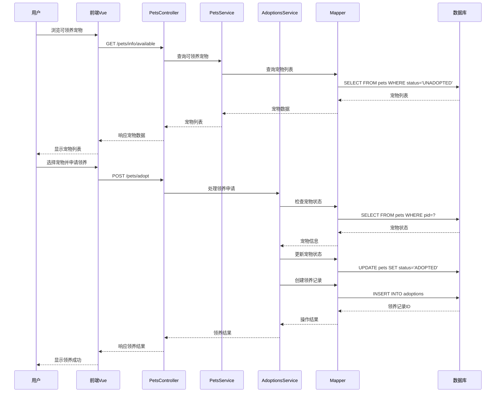
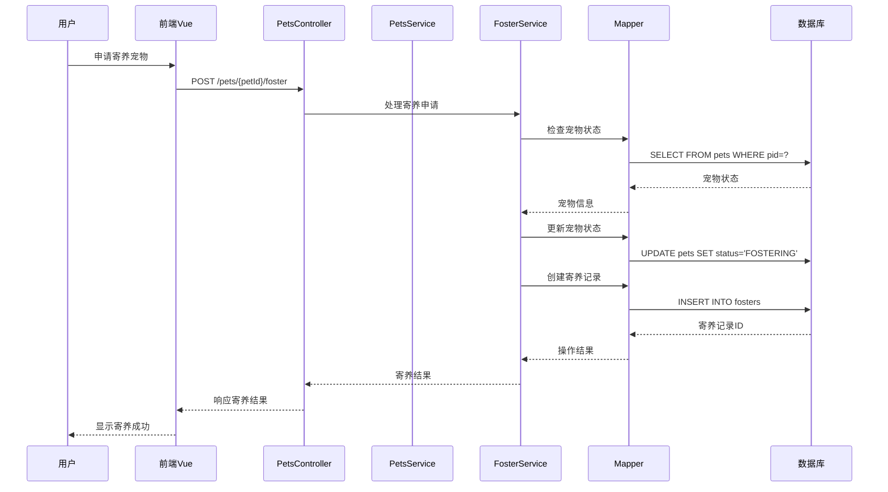
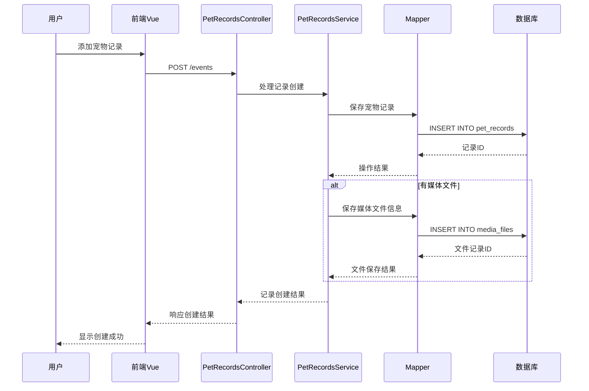
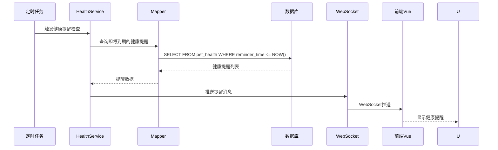
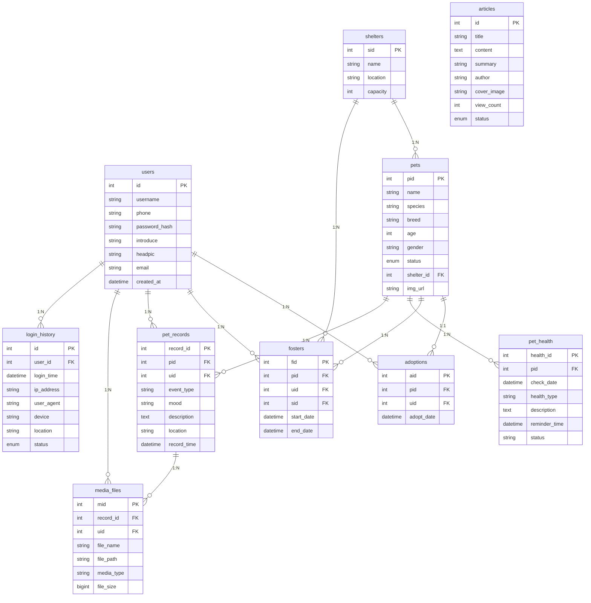
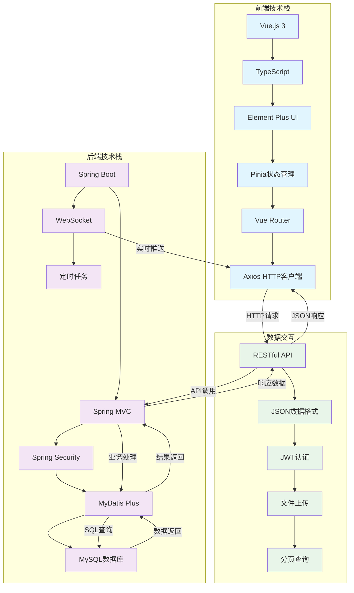

# 宠物领养平台数据流图

## 系统架构概览

该宠物领养平台采用前后端分离架构：
- **前端**: Vue.js 3 + TypeScript + Element Plus
- **后端**: Spring Boot + MyBatis Plus + MySQL
- **通信**: RESTful API + WebSocket

## 数据流图

## 核心业务数据流

### 1. 用户认证流程

### 2. 宠物领养流程

### 3. 宠物寄养流程

### 4. 宠物记录管理流程

### 5. 健康提醒流程

## 数据模型关系图

## 技术架构数据流

## 关键数据流说明

1. **用户认证数据流**：
   - 用户登录信息通过前端发送到后端
   - 后端验证用户凭据并生成JWT Token
   - Token存储在前端localStorage中
   - 后续请求携带Token进行身份验证

2. **宠物管理数据流**：
   - 宠物信息存储在pets表中
   - 宠物状态包括：UNADOPTED（未领养）、ADOPTED（已领养）、FOSTERING（寄养中）等
   - 领养和寄养操作会更新宠物状态并创建相应记录

3. **文件上传数据流**：
   - 媒体文件通过multipart/form-data上传
   - 文件保存在服务器uploads/media目录
   - 文件信息记录在media_files表中

4. **实时通信数据流**：
   - 健康提醒通过WebSocket实时推送给前端
   - 前端接收推送并显示提醒通知

5. **分页查询数据流**：
   - 列表查询支持分页参数
   - 后端使用MyBatis Plus分页插件
   - 返回分页元数据（总记录数、当前页、总页数等）

这个数据流图展示了宠物领养平台中数据如何在各个组件之间流动，从用户界面到数据库，以及后端服务之间的交互关系。